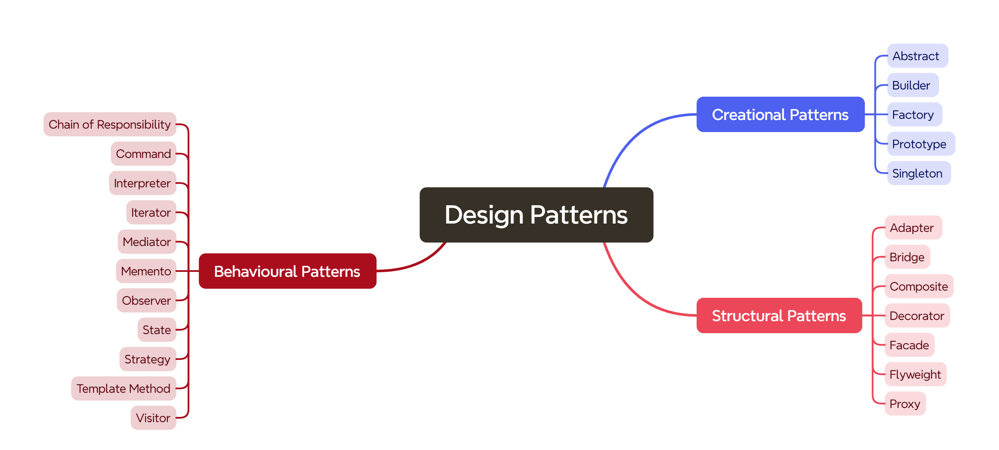

<h1 align="center">Design Patterns In Csharp</h1>

The most common Design Patterns you need to know with examples in C#.

## What are Design Patterns?

The concept of design patterns in software engineering was popularized in the early 1990s by the famous book **["Design Patterns: Elements of Reusable Object-Oriented Software"](https://amzn.to/3SKaa9x)** by Erich Gamma, Richard Helm, Ralph Johnson, and John Vlissides, collectively known as the "Gang of Four" (GoF). However, the roots of design patterns go back further, drawing inspiration from the field of architecture.

Architect Christopher Alexander introduced the idea of patterns in architecture in his 1977 book **"A Pattern Language,"** where he described solutions to common design problems in urban planning and building architecture. Alexander's work emphasized that each pattern solves a specific problem and is part of a more extensive design system. This approach resonated with software developers facing similar challenges in software construction.

Seeing the potential of Alexander's concepts in software development, the GoF adapted and expanded these ideas to object-oriented programming. Their book **introduced 23 design patterns categorized into Creational, Structural, and Behavioral patterns**, providing a standardized approach to solving common software design issues.

In software development, design patterns serve a similar purpose—**they provide templated solutions to recurring problems**, ensuring that you don't have to reinvent the wheel each time you encounter a familiar issue.

> **Software design pattern** - Is a common solution to common problem that have been observed in practice. 

## Give a Star! :star:

If you like or are using this project to learn or start your solution, please give it a star. Thanks!

## Design Pattern Types

Design patterns can be separated into three main categories:

* **Creational Patterns** - Object creation

    - **Singleton Pattern**: Ensures a class has only one instance and provides a global point of access to it. This is particularly useful for managing resources like database connections.

    - **Factory Method Pattern**: Defines an interface for creating an object but lets subclasses alter the type of objects that will be created. It's ideal when you have a superclass with multiple subclasses, and must create an instance of one of these subclasses based on some initialization parameters.

    - **Abstract Factory Pattern**: Offers an interface for creating families of related or dependent objects without specifying their concrete classes. This pattern shines when you must ensure that the created objects can work together without knowing their exact types.

    - **Builder Pattern**: Separates the construction of a complex object from its representation, allowing the same construction process to create various representations. This pattern is excellent for when you need to create an object with many optional or required components.

    - **Prototype Pattern**: Creates new objects by copying an existing object, known as the prototype. This is particularly useful in scenarios where the cost of creating an object is heavier than copying an existing one.

* **Structural Patterns** - Object assembly

    - **Adapter Pattern**: Allows incompatible interfaces to work together. It acts as a bridge between two incompatible interfaces, enabling them to communicate without changing their existing code. This pattern is perfect when integrating new features or libraries without disrupting existing code.

    - **Composite Pattern**: Enables you to treat individual objects and compositions of objects uniformly. It's ideal for representing part-whole hierarchies where you want to ignore the difference between compositions of objects and individual objects.

    - **Proxy Pattern**: Provides a placeholder for another object to control access to it. This is useful for lazy loading, controlling access, or logging, acting as an intermediary between the client and the actual object to add a processing layer.

    - **Flyweight Pattern**: Minimizes memory use by sharing as much data as possible with similar objects; it's a boon for efficiency when working with many objects with some shared state.

    - **Facade Pattern**: Offers a simplified interface to a complex system of classes, library, or framework. Providing a higher-level interface makes the subsystem easier to use, reducing complexity and promoting decoupling.

    - **Bridge Pattern**: Decouples an abstraction from its implementation so that the two can vary independently. It's particularly useful when extending a class in several orthogonal (independent) dimensions.

    - **Decorator Pattern**: Allows behavior to be added to an individual object, either statically or dynamically, without affecting the behavior of other objects from the same class. This pattern provides a flexible alternative to subclassing for extending functionality.
 
* **Behavioral Patterns** - Object interactions

    - **Strategy Pattern**: Allows you to define a family of algorithms, encapsulate each one, and make them interchangeable. Strategy lets the algorithm vary independently from clients that use it. This pattern is perfect when you have multiple ways to accomplish a task, and you want to select the method at runtime.

    - **Observer Pattern**: Defines a dependency between objects so that when one object changes its state, all its dependents are notified and updated automatically. It's ideal for implementing distributed event handling systems, where changing one object's state needs to be reflected in another.

    - **Command Pattern**: Turns a request into a stand-alone object containing all the request information. This transformation allows you to parameterize methods with different requests, delay or queue a request's execution, and support undoable operations.

    - **Iterator Pattern**: Provides a way to access the elements of an aggregate object sequentially without exposing its underlying representation. This pattern is useful for collections of objects to provide a standard way to traverse them and potentially access a selection of elements without exposing the internal structure.

    - **State Pattern**: An object can alter its behavior when its internal state changes. The object will appear to change its class. This is beneficial when an object's behavior depends on its state and must be able to change its behavior at runtime depending on that state.

    - **Memento Pattern**: Without violating encapsulation, capture and externalize an object's internal state so that the object can be returned to this state later. This pattern is useful for implementing undo mechanisms or saving and restoring an object's state.

    - **Mediator Pattern**: Reduces chaos between interacting classes by encapsulating how disparate sets of objects interact and communicate. Doing so helps prevent the "spaghetti code" scenario where multiple classes communicate directly and in a complex way.

    - **Chain of Responsibility Pattern**: Passes the request along a chain of handlers. Upon receiving a request, each handler decides to process the request or pass it to the next handler in the chain. It's particularly useful for processing multiple requests in a decentralized manner.

    - **Visitor Pattern**: Let you define a new operation without changing the classes of the elements on which it operates. Ideal for scenarios where you need to perform operations across a group of objects with different classes.

    - **Interpreter Pattern**: Provides a way to evaluate language grammar or expression. This is useful in developing tools and compilers for new programming or scripting languages.

    - **Template Method Pattern**: Defines the skeleton of an algorithm in the superclass but lets subclasses override specific algorithm steps without changing its structure. It's beneficial when a multi-step process requires flexibility while maintaining the overall structure.

## Don’t fall into the Design Patterns trap

You should be warned that you will probably fall into **the Design Patterns trap** when you first learn design patterns. This means you will try to squeeze a pattern in every solution, and your codebase will become over-engineering and unusable very soon.

But we want to make our codebase as simple as possible, so Design patterns are not the silver bullet for all problems. We should not try to put them into every problem we have because they are solutions to problems, not tools that should be used everywhere. **If you can implement a simple solution without using a design pattern, do it!**

We find something even more problematic in the latest [O'Reilly Technology Trends for 2024](https://www.oreilly.com/radar/technology-trends-for-2024/). Managers are asking developers how many patterns they used. This is an open door to over-engineering.

But that's not all, we also saw examples of codebases that [organize their code by folder names of design patterns](https://youtu.be/P7CfWtR-ECk?t=408). **It cannot be more wrong than this!**

Yet, understanding design patterns keeps you from reinventing wheels.

---

In the rest of the article, we will go through all the important Design Patterns. During many years of using these patterns, I noticed that some are used often, some rarely, and some are not. Here, I will present only those patterns you need daily. 

Every pattern has an **[implementation in C# language](src)**. The solution can be run using `.NET 8`.

## Creational Design Patterns

### Singleton pattern

**Usage**: Use when a single instance of a class is needed. Some examples are logging and database connections. 

**Real-world example**: Only one CEO leads the company, making decisions and representing the entire organization, like a singleton providing global access and control.

**The remark about usage**: The Singleton pattern is regarded as **an anti-pattern**; hence, using them excessively is advised. Why? Using it, we tend to make procedural code with global variables.

**UML diagram of Singleton pattern:**

**[An implementation of the Singleton pattern in C#.](Singleton)**

> An important note about the Singleton pattern is that it poses a **significant issue for multithreading**, especially in a scenario where multiple threads may simultaneously attempt to create an instance of the Singleton class. This can lead to multiple instances if proper synchronization is not enforced, thus violating the core principle of the Singleton pattern that only one instance of the class should ever exist. There are multiple solutions to this problem, such as eager initialization, double-checked locking, or lazy initialization.

### Factory method pattern

**Usage**: Decouple object creation from usage. For example, you create different types of database connections based on configuration.

**Real-world example**: Think of a pizza joint with a "Pizza Factory" instead of chefs. Customers order "cheese" or "pepperoni," not knowing how it's made. Based on the order, this factory tells specialized "CheesePizza" or "PepperoniPizza" builders to get cookin'. Each builder adds signature toppings, keeping the creation logic separate but the ordering process smooth.

**The remark about usage**: It can lead to increased classes, potentially making the codebase more complex.

**UML diagram of Factory method pattern:**

**[An implementation of the Factory Method pattern in C#.](FactoryMethod)**

### Builder pattern

**Usage**: Constructing complex objects step by step. For example, if you need to create a complex domain object.

**Real-world example**: If we hire an architect to design our dream home, we don't need to know every construction detail. We need to tell the architect our preferences (number of rooms, style, materials), and they create a blueprint with those specifications. The architect acts as the "builder pattern," guiding us through the creation process with clear steps (foundation, walls, roof), ensuring correct order, and handling complex details. You make choices (fireplace or no fireplace?), and the builder incorporates them, constructing the house piece by piece until it's complete. 

**The remark about usage**: It could lead to increased complexity due to the introduction of multiple new classes.

**UML diagram of Builder pattern:**

**[An implementation of the Builder pattern in C#.](Builder)**

Other **exciting design patterns from this group** are:

* **Abstract Factory**: Create families of related objects. For example, I build parsers for different file formats (e.g., JSON, XML, CSV). Check the **[implementation in C#](AbstractFactory)**.

* **Prototype**: Creating duplicate objects and reusing cached objects to reduce database calls. Check the **[implementation in C#](Prototype)**.

## Structural Design Patterns

### Adapter pattern

**Usage**: Make incompatible interfaces compatible. For example, it integrates a new logging library into an existing system that expects a different interface.

**Real-world example**: Allows you to use your devices in different countries by adapting to the local power outlet (adapter mediates communication between incompatible systems).

**The remark about usage**: Can lead to an increase in the number of adapters, making the system more complicated. Modifying the service class to align with the rest of the codebase could be simpler sometimes.

**UML diagram of Adapter pattern:**

**[An implementation of the Adapter pattern in C#.](Adapter)**

### Composite pattern

**Usage**: Represent part-whole hierarchies. For example, graphic objects in a drawing application can be grouped and treated uniformly.

**Real-world example**: In the library, books are organized on shelves, but each shelf can further hold categories (fiction, history). These categories might even contain subcategories (romance, mystery). Each shelf acts as a composite, keeping both individual books (leaf nodes) and other categories (composite nodes).

**The remark about usage**: Restricting operations for certain components or leaves in the hierarchy could be challenging.

**UML diagram of Composite pattern:**

**[An implementation of the Composite pattern in C#.](Composite)**

### Proxy pattern

**Usage**: Control access to objects. For example, lazy loading of a high-resolution image in a web application.

**Real-world example**: Let’s assume you’re a CEO with a personal assistant who acts as a "proxy," handling requests and shielding you from unnecessary distractions. The assistant assesses each request, prioritizing the important ones, filtering out spam, and preparing relevant info. Only the filtered essentials reach the CEO, who focuses on big decisions, while the assistant handles the rest. 

**The remark about usage**: Overusing proxies can add unnecessary complexity and impact performance.

**UML diagram of Proxy pattern:**

**[An implementation of the Proxy pattern in C#.](Proxy)**

### Decorator pattern

**Usage**: Dynamically add/remove behavior. For example, we are implementing compression or encryption on top of file streams.

**Real-world example**: If we want to make a coffee, we would start with plain coffee (the core object). Then, "decorate" it with cream (adds richness), sugar (sweetness), and cinnamon (extra flavor), each a "decorator" enhancing the base coffee without altering it. You can even combine them (multiple decorators) for unique creations like a creamy, sweet cinnamon latte!

**The remark about usage**: Overuse of decorators can lead to a complex hierarchy of objects.

**UML diagram of Decorator pattern:**

**[An implementation of the Decorator pattern in C#.](Decprator)**

### Facade pattern

**Usage**: It provides a simplified interface to a complex subsystem. 

**Real-world example**: Let's say we are visiting a hotel. We need various services - ordering room service, booking spa appointments, requesting housekeeping. Instead of contacting each department individually, you call the front desk. The front desk acts as a facade, hiding the complexity of the underlying systems. They take your request, communicate with the relevant department (kitchen, spa, housekeeping), and deliver the service, making everything seem effortless. You don't need to know how each department works; the facade provides a simplified interface to access them all.

**The remark about usage**: Facades have the potential to transform into god objects connected to every application class.

**[An implementation of the Facade pattern in C#.](Facade)**

Another interesting design pattern from this group is the **Bridge pattern**. It is used to decouple abstraction from implementation. For example, I am separating platform-specific code from core logic. Check the [implementation in C#](Bridge).

## Behavioral Design Patterns

### Strategy pattern

**Usage**: Define a family of algorithms. For example, they allow users to choose different sorting or compression algorithms.

**Real-world example**: Let’s plan a travel from city A to city B. You can choose a "transportation strategy" based on your needs: take a fast train (speed focus), a comfortable bus (comfort focus), or a budget-friendly carpool (low-cost focus). 

**The remark about usage**: This could lead to an increased number of classes and complexity when dealing with many strategies. There is no need to add new classes and interfaces if you have only a few algorithms that change rarely.

**UML diagram of Strategy pattern:**

**[An implementation of the Strategy pattern in C#.](Strategy)**

### Observer pattern

**Usage**: Maintain a consistent state by being notified of changes and, for example, notifying subscribers of events in a messaging system.

**Real-world example**: We can think of a breaking news app. Users subscribe to specific topics (sports, politics, etc.), acting as "observers." When news breaks in a subscribed topic, the "observer pattern" notifies all relevant users with personalized alerts. Sports fans get their scores, and political enthusiasts receive election updates without them needing to check actively. 

**The remark about usage**: This can result in performance issues when there are numerous observers or the update logic is complex. Subscribers are notified in an unpredictable sequence.

**UML diagram of Observer pattern:**

**[An implementation of the Observer pattern in C#.](Observer)**

### Command pattern

**Usage**: Encapsulate a request as an object. For example, I implement undo/redo functionality in text or image editor.

**Real-world example**: Picture ordering food at a restaurant. You tell the waiter your wishes (pizza, extra cheese), creating an "order command." The waiter then acts as a messenger, carrying your "command" to the Chef in the kitchen (receiver). The Chef, receiving the "command," makes your pizza precisely as specified. This separation of ordering (command) from making (execution) lets you change or cancel easily.

**The remark about usage**: It has the potential to introduce complexity, as it requires creating additional classes for each action or request, complicating the architecture for simple operations.

**UML diagram of Command pattern:**

**[An implementation of the Command pattern in C#.](Command)**

